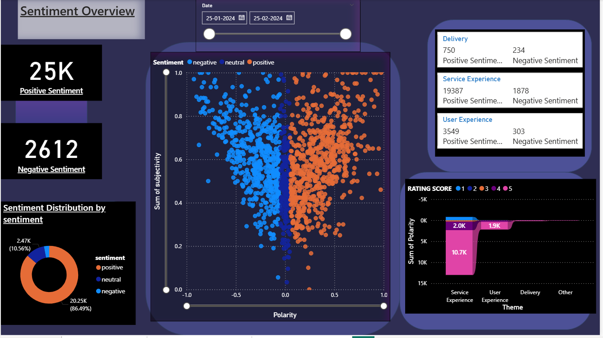
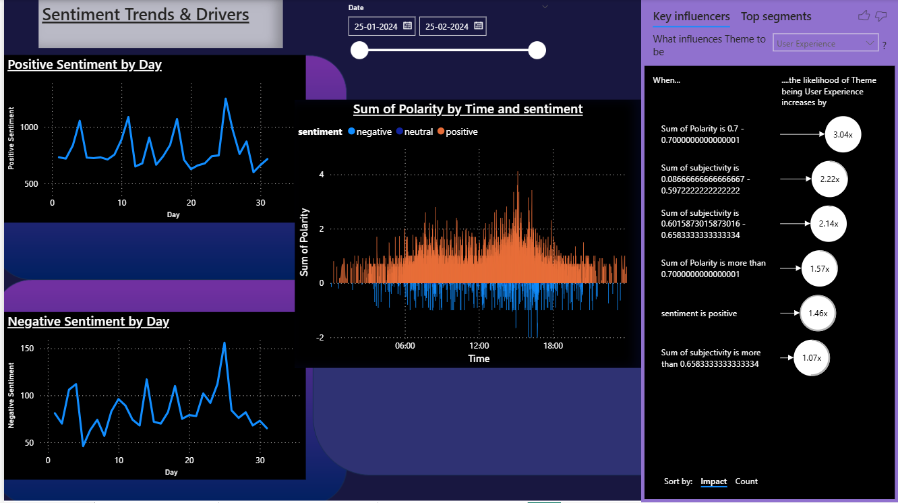
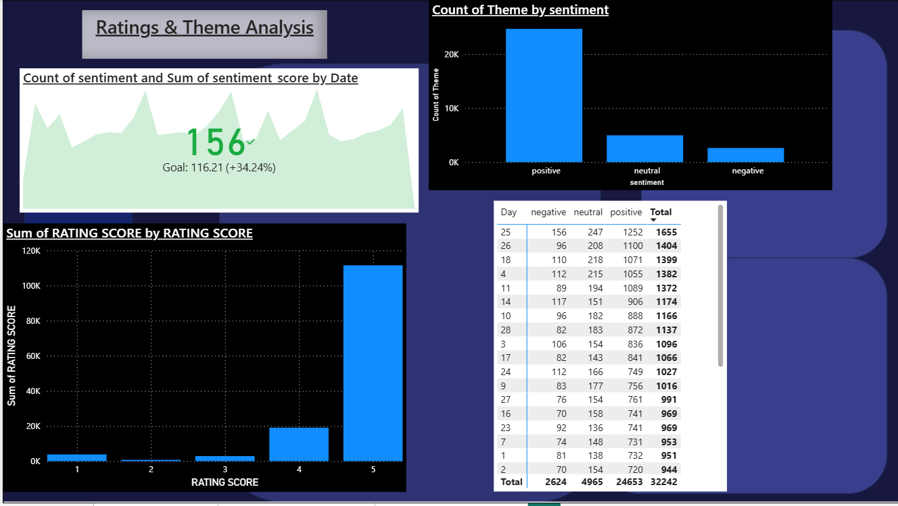

# Sentiment Analysis Dashboard – Business Analytics Internship

## Overview
This Power BI project was developed during my internship as a **Business Analytics Intern at Coreline Solutions Inc. (Remote)** between **June 2025 and July 2025**.

The dashboard analyses customer review data to understand **sentiment patterns, key drivers of sentiment, rating behaviour, and theme-level performance**.  
It supports data-driven decision-making by identifying areas impacting customer experience, service quality, and delivery performance.

---

## Project Objectives
- Analyse customer sentiment (positive, neutral, negative) from review data
- Identify key drivers influencing sentiment using polarity and subjectivity
- Track sentiment trends over time and by day
- Compare customer ratings across themes such as delivery, service, and user experience
- Highlight areas for improving customer satisfaction

---

## Key Insights
- Positive sentiment significantly outweighs negative sentiment across the review period
- User Experience and Service Experience are the strongest contributors to positive sentiment
- Negative sentiment spikes occur on specific days, indicating operational or service issues
- Higher polarity and subjectivity strongly influence positive sentiment outcomes
- Rating scores of 4 and 5 dominate, showing overall customer satisfaction

---

## Dashboard Structure

### 1. Sentiment Overview
- Overall positive and negative sentiment counts
- Sentiment distribution by category
- Polarity vs subjectivity scatter analysis
- Theme-wise sentiment comparison

### 2. Sentiment Trends & Drivers
- Positive and negative sentiment trends by day
- Time-based polarity analysis
- Key Influencers visual to identify drivers of sentiment
- Impact-based ranking of influencing factors

### 3. Ratings & Theme Analysis
- Sentiment and sentiment score trends by date
- Rating score distribution
- Theme-level sentiment counts
- Detailed review-level analysis

---

## Tools & Technologies
- Power BI
- Microsoft Excel
- Text Analytics (Polarity & Subjectivity Metrics)

---

## Dataset
- Customer review dataset (Zomato-based review data)
- Data includes review text, ratings, themes, timestamps, polarity, subjectivity, and sentiment classification

---

## Data Disclaimer
The dataset used in this project is anonymised and/or publicly available.
This analysis was conducted strictly for **educational and internship demonstration purposes**
and does not represent official business decisions or proprietary company data.

---

## Dashboard Preview

### Sentiment Overview

### Sentiment Trends & Drivers

### Ratings & Theme Analysis

